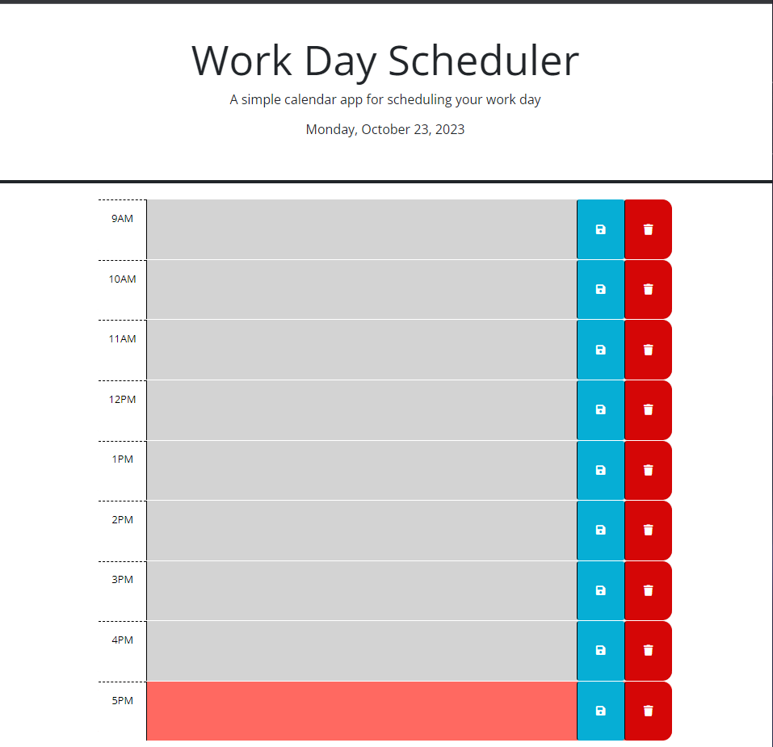

# octo-Scheduler
A work day Sceduler that interacts with third-party api's like jquery, bootstrap and day.js

## Deployment

[Link to the website](https://ronaldmartin02.github.io/octo-work-Scheduler/)
 

## Usage

You can use this hourly scheduler to better manage your busy 9-5 job. You can save and delete what you have to do during those times. There are 3 colors the text box can be: Grey, Green and Red. Grey means that the hour is in the past, green means that the hour is in the future and the red means that hour is in the present.

## Credits

N/A

## License

MIT License

